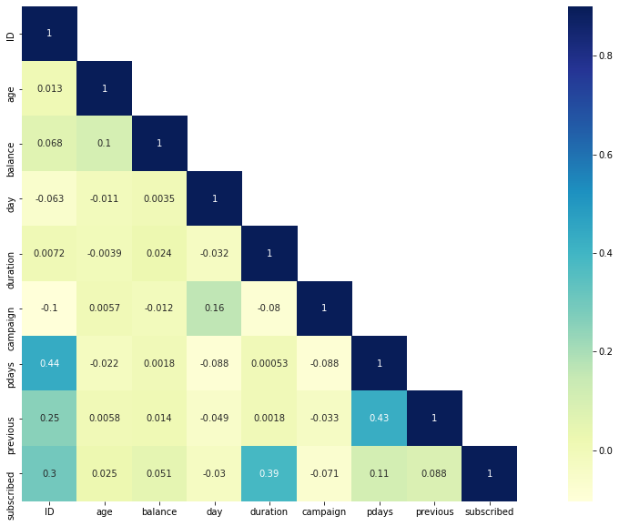

# Project : Predict if a client will make a fixed deposit
Based on the age of the client, job type, marital status, etc., predict if the client will make a fixed deposit with the bank.

# Reading files


```python
#importing libraries
import pandas as pd
import numpy as np
import seaborn as sn
import matplotlib.pyplot as plt
import warnings
warnings.filterwarnings("ignore")
```


```python
train=pd.read_csv("train(1).csv")
test=pd.read_csv("test.csv")
```


```python
train.shape,test.shape
```


    ((31647, 18), (13564, 17))


```python
train.columns
```


    Index(['ID', 'age', 'job', 'marital', 'education', 'default', 'balance',
           'housing', 'loan', 'contact', 'day', 'month', 'duration', 'campaign',
           'pdays', 'previous', 'poutcome', 'subscribed'],
          dtype='object')


```python
train.head()
```


<div>
<style scoped>
    .dataframe tbody tr th:only-of-type {
        vertical-align: middle;
    }

    .dataframe tbody tr th {
        vertical-align: top;
    }

    .dataframe thead th {
        text-align: right;
    }
</style>
<table border="1" class="dataframe">
  <thead>
    <tr style="text-align: right;">
      <th></th>
      <th>ID</th>
      <th>age</th>
      <th>job</th>
      <th>marital</th>
      <th>education</th>
      <th>default</th>
      <th>balance</th>
      <th>housing</th>
      <th>loan</th>
      <th>contact</th>
      <th>day</th>
      <th>month</th>
      <th>duration</th>
      <th>campaign</th>
      <th>pdays</th>
      <th>previous</th>
      <th>poutcome</th>
      <th>subscribed</th>
    </tr>
  </thead>
  <tbody>
    <tr>
      <th>0</th>
      <td>26110</td>
      <td>56</td>
      <td>admin.</td>
      <td>married</td>
      <td>unknown</td>
      <td>no</td>
      <td>1933</td>
      <td>no</td>
      <td>no</td>
      <td>telephone</td>
      <td>19</td>
      <td>nov</td>
      <td>44</td>
      <td>2</td>
      <td>-1</td>
      <td>0</td>
      <td>unknown</td>
      <td>no</td>
    </tr>
    <tr>
      <th>1</th>
      <td>40576</td>
      <td>31</td>
      <td>unknown</td>
      <td>married</td>
      <td>secondary</td>
      <td>no</td>
      <td>3</td>
      <td>no</td>
      <td>no</td>
      <td>cellular</td>
      <td>20</td>
      <td>jul</td>
      <td>91</td>
      <td>2</td>
      <td>-1</td>
      <td>0</td>
      <td>unknown</td>
      <td>no</td>
    </tr>
    <tr>
      <th>2</th>
      <td>15320</td>
      <td>27</td>
      <td>services</td>
      <td>married</td>
      <td>secondary</td>
      <td>no</td>
      <td>891</td>
      <td>yes</td>
      <td>no</td>
      <td>cellular</td>
      <td>18</td>
      <td>jul</td>
      <td>240</td>
      <td>1</td>
      <td>-1</td>
      <td>0</td>
      <td>unknown</td>
      <td>no</td>
    </tr>
    <tr>
      <th>3</th>
      <td>43962</td>
      <td>57</td>
      <td>management</td>
      <td>divorced</td>
      <td>tertiary</td>
      <td>no</td>
      <td>3287</td>
      <td>no</td>
      <td>no</td>
      <td>cellular</td>
      <td>22</td>
      <td>jun</td>
      <td>867</td>
      <td>1</td>
      <td>84</td>
      <td>3</td>
      <td>success</td>
      <td>yes</td>
    </tr>
    <tr>
      <th>4</th>
      <td>29842</td>
      <td>31</td>
      <td>technician</td>
      <td>married</td>
      <td>secondary</td>
      <td>no</td>
      <td>119</td>
      <td>yes</td>
      <td>no</td>
      <td>cellular</td>
      <td>4</td>
      <td>feb</td>
      <td>380</td>
      <td>1</td>
      <td>-1</td>
      <td>0</td>
      <td>unknown</td>
      <td>no</td>
    </tr>
  </tbody>
</table>
</div>


```python
test.head()
```


<div>
<style scoped>
    .dataframe tbody tr th:only-of-type {
        vertical-align: middle;
    }

    .dataframe tbody tr th {
        vertical-align: top;
    }

    .dataframe thead th {
        text-align: right;
    }
</style>
<table border="1" class="dataframe">
  <thead>
    <tr style="text-align: right;">
      <th></th>
      <th>ID</th>
      <th>age</th>
      <th>job</th>
      <th>marital</th>
      <th>education</th>
      <th>default</th>
      <th>balance</th>
      <th>housing</th>
      <th>loan</th>
      <th>contact</th>
      <th>day</th>
      <th>month</th>
      <th>duration</th>
      <th>campaign</th>
      <th>pdays</th>
      <th>previous</th>
      <th>poutcome</th>
    </tr>
  </thead>
  <tbody>
    <tr>
      <th>0</th>
      <td>38441</td>
      <td>32</td>
      <td>services</td>
      <td>married</td>
      <td>secondary</td>
      <td>no</td>
      <td>118</td>
      <td>yes</td>
      <td>no</td>
      <td>cellular</td>
      <td>15</td>
      <td>may</td>
      <td>20</td>
      <td>6</td>
      <td>-1</td>
      <td>0</td>
      <td>unknown</td>
    </tr>
    <tr>
      <th>1</th>
      <td>40403</td>
      <td>78</td>
      <td>retired</td>
      <td>divorced</td>
      <td>primary</td>
      <td>no</td>
      <td>2787</td>
      <td>no</td>
      <td>no</td>
      <td>telephone</td>
      <td>1</td>
      <td>jul</td>
      <td>372</td>
      <td>1</td>
      <td>-1</td>
      <td>0</td>
      <td>unknown</td>
    </tr>
    <tr>
      <th>2</th>
      <td>3709</td>
      <td>31</td>
      <td>self-employed</td>
      <td>single</td>
      <td>tertiary</td>
      <td>no</td>
      <td>144</td>
      <td>yes</td>
      <td>no</td>
      <td>unknown</td>
      <td>16</td>
      <td>may</td>
      <td>676</td>
      <td>1</td>
      <td>-1</td>
      <td>0</td>
      <td>unknown</td>
    </tr>
    <tr>
      <th>3</th>
      <td>37422</td>
      <td>57</td>
      <td>services</td>
      <td>single</td>
      <td>primary</td>
      <td>no</td>
      <td>3777</td>
      <td>yes</td>
      <td>no</td>
      <td>telephone</td>
      <td>13</td>
      <td>may</td>
      <td>65</td>
      <td>2</td>
      <td>-1</td>
      <td>0</td>
      <td>unknown</td>
    </tr>
    <tr>
      <th>4</th>
      <td>12527</td>
      <td>45</td>
      <td>blue-collar</td>
      <td>divorced</td>
      <td>secondary</td>
      <td>no</td>
      <td>-705</td>
      <td>no</td>
      <td>yes</td>
      <td>unknown</td>
      <td>3</td>
      <td>jul</td>
      <td>111</td>
      <td>1</td>
      <td>-1</td>
      <td>0</td>
      <td>unknown</td>
    </tr>
  </tbody>
</table>
</div>


```python
train.dtypes
```


    ID             int64
    age            int64
    job           object
    marital       object
    education     object
    default       object
    balance        int64
    housing       object
    loan          object
    contact       object
    day            int64
    month         object
    duration       int64
    campaign       int64
    pdays          int64
    previous       int64
    poutcome      object
    subscribed    object
    dtype: object


```python
train.describe()
```


<div>
<style scoped>
    .dataframe tbody tr th:only-of-type {
        vertical-align: middle;
    }

    .dataframe tbody tr th {
        vertical-align: top;
    }

    .dataframe thead th {
        text-align: right;
    }
</style>
<table border="1" class="dataframe">
  <thead>
    <tr style="text-align: right;">
      <th></th>
      <th>ID</th>
      <th>age</th>
      <th>balance</th>
      <th>day</th>
      <th>duration</th>
      <th>campaign</th>
      <th>pdays</th>
      <th>previous</th>
    </tr>
  </thead>
  <tbody>
    <tr>
      <th>count</th>
      <td>31647.000000</td>
      <td>31647.000000</td>
      <td>31647.000000</td>
      <td>31647.000000</td>
      <td>31647.000000</td>
      <td>31647.000000</td>
      <td>31647.000000</td>
      <td>31647.000000</td>
    </tr>
    <tr>
      <th>mean</th>
      <td>22563.972162</td>
      <td>40.957247</td>
      <td>1363.890258</td>
      <td>15.835466</td>
      <td>258.113534</td>
      <td>2.765697</td>
      <td>39.576042</td>
      <td>0.574272</td>
    </tr>
    <tr>
      <th>std</th>
      <td>13075.936990</td>
      <td>10.625134</td>
      <td>3028.304293</td>
      <td>8.337097</td>
      <td>257.118973</td>
      <td>3.113830</td>
      <td>99.317592</td>
      <td>2.422529</td>
    </tr>
    <tr>
      <th>min</th>
      <td>2.000000</td>
      <td>18.000000</td>
      <td>-8019.000000</td>
      <td>1.000000</td>
      <td>0.000000</td>
      <td>1.000000</td>
      <td>-1.000000</td>
      <td>0.000000</td>
    </tr>
    <tr>
      <th>25%</th>
      <td>11218.000000</td>
      <td>33.000000</td>
      <td>73.000000</td>
      <td>8.000000</td>
      <td>104.000000</td>
      <td>1.000000</td>
      <td>-1.000000</td>
      <td>0.000000</td>
    </tr>
    <tr>
      <th>50%</th>
      <td>22519.000000</td>
      <td>39.000000</td>
      <td>450.000000</td>
      <td>16.000000</td>
      <td>180.000000</td>
      <td>2.000000</td>
      <td>-1.000000</td>
      <td>0.000000</td>
    </tr>
    <tr>
      <th>75%</th>
      <td>33879.500000</td>
      <td>48.000000</td>
      <td>1431.000000</td>
      <td>21.000000</td>
      <td>318.500000</td>
      <td>3.000000</td>
      <td>-1.000000</td>
      <td>0.000000</td>
    </tr>
    <tr>
      <th>max</th>
      <td>45211.000000</td>
      <td>95.000000</td>
      <td>102127.000000</td>
      <td>31.000000</td>
      <td>4918.000000</td>
      <td>63.000000</td>
      <td>871.000000</td>
      <td>275.000000</td>
    </tr>
  </tbody>
</table>
</div>


# 2. Univariate Analysis 


```python
train['subscribed'].value_counts()
```


    no     27932
    yes     3715
    Name: subscribed, dtype: int64


```python
train['subscribed'].value_counts( normalize = True)
```


    no     0.882611
    yes    0.117389
    Name: subscribed, dtype: float64


```python
train['subscribed'].value_counts().plot.bar()
```


    <AxesSubplot:>


    

    


```python
sn.distplot(train['age'])
```


    <AxesSubplot:xlabel='age', ylabel='Density'>


    

    


```python
train['job'].value_counts().plot.bar()
```


    <AxesSubplot:>


    

    


```python
train['default'].value_counts().plot.bar()
```


    <AxesSubplot:>


    

    


# 3. Bivariate Analysis 


```python
job=pd.crosstab(train['job'],train['subscribed'])
print(job)
```

    subscribed       no  yes
    job                     
    admin.         3179  452
    blue-collar    6353  489
    entrepreneur    923   85
    housemaid       795   79
    management     5716  923
    retired        1212  362
    self-employed   983  140
    services       2649  254
    student         453  182
    technician     4713  594
    unemployed      776  129
    unknown         180   26
    


```python
job.div(job.sum(1).astype(float),axis=0).plot(kind='bar', stacked=True,figsize=(8,8))
plt.xlabel('Jobs')
plt.ylabel('Percentage')
```


    Text(0, 0.5, 'Percentage')


    

    


```python
default=pd.crosstab(train['default'],train['subscribed'])
print(default)
default.div(default.sum(1).astype(float),axis=0).plot(kind='bar', stacked=True,figsize=(8,8))
plt.xlabel('default')
plt.ylabel('Percentage')
```

    subscribed     no   yes
    default                
    no          27388  3674
    yes           544    41
    


    Text(0, 0.5, 'Percentage')


    

    


```python
# replacing subcribed to continuous variable
train['subscribed'].replace('no',0, inplace=True)
train['subscribed'].replace('yes',1, inplace=True)
```


```python
#checking correlation of subscribed with other variables
corr=train.corr()
mask=np.array(corr)
mask[np.tril_indices_from(mask)] = False
fig,ax= plt.subplots()
fig.set_size_inches(20,10)
sn.heatmap(corr, mask=mask,vmax=.9, square=True,annot=True, cmap="YlGnBu")
```


    <AxesSubplot:>


    

    


# Model Building


```python
#checking for missing value
train.isnull().sum()
```


    ID            0
    age           0
    job           0
    marital       0
    education     0
    default       0
    balance       0
    housing       0
    loan          0
    contact       0
    day           0
    month         0
    duration      0
    campaign      0
    pdays         0
    previous      0
    poutcome      0
    subscribed    0
    dtype: int64


```python
x=train.drop('subscribed',axis=1)
y=train['subscribed']
```


```python
x=pd.get_dummies(x)
```


```python
from sklearn.model_selection import train_test_split
```


```python
x_train,x_val,y_train,y_val= train_test_split(x,y, test_size=0.2, random_state=12)
```

# Logistic Regression 


```python
from sklearn.linear_model import LogisticRegression
```


```python
loreg=LogisticRegression()
```


```python
loreg.fit(x_train,y_train)
```


    LogisticRegression()


```python
prediction=loreg.predict(x_val)
```


```python
prediction
```


    array([0, 0, 0, ..., 0, 0, 0], dtype=int64)


```python
from sklearn.metrics import accuracy_score
```


```python
accuracy_score(y_val,prediction)
```


    0.8895734597156398


# Decision Tree


```python
from sklearn.tree import DecisionTreeClassifier
```


```python
clf= DecisionTreeClassifier(max_depth=4, random_state=0)
```


```python
clf.fit(x_train,y_train)
```


    DecisionTreeClassifier(max_depth=4, random_state=0)


```python
prediction=clf.predict(x_val)
```


```python
accuracy_score(y_val,prediction)
```


    0.9042654028436019


# Predicting


```python
test=pd.get_dummies(test)
```


```python
test_predict= clf.predict(test)
```

# Create csv file of prediction


```python
submit=pd.DataFrame()
```


```python
submit['ID']=test['ID']
submit['subscribed']=test_predict
```


```python
submit['subscribed'].replace(0,'no',inplace=True)
submit['subscribed'].replace(1,'yes',inplace=True)
```


```python
submit.to_csv('submission.csv',header=True, index=False)
```
